# Smoke detection


## Domain Proyek

Yang melatar belakangi saya membuat project ini adalah karena indonesia menjadi negara dengan mayoritas masyarakatnya perokok aktif dan banyak tempat yang   seharusnya dilarang merokok namun seringkali perokok tetap membakar rokoknya ditempat tersebut.   
- reference 1: https://www.tribunnews.com/internasional/2021/06/02/indonesia-peringkat-ke-3-dan-jepang-ke-7-terbanyak-perokok-di-dunia
- reference 2: https://www.suara.com/health/2021/05/30/132226/indonesia-masuk-10-negara-penyumbang-perokok-terbanyak-di-dunia

- kenapa masalah ini harus diselesaikan? karena banyak dari masyarakat indonesia sering melanggar peraturan dilarang merokok diarea tersebut mengakibatkan orang yang berada di area tersebut dapat terkena dampaknya juga bahkan dapat melebihi dampak yang dihasilkan dari perokok itu sendiri. orang-orang yang berada di no smoking area mengasumsikan kalo diarea tersebut tidak ada perokok sehingga orang-orang yang tidak ingin terkena asap rokok memilih tempat tersebut. selain itu model machine learning ini juga dapat digunakan untuk mendeteksi asap kebakaran jika didalam rumah atau ruangan terdapat asap. salah satu solusi yang dapat saya berikan adalah dengan cara membuat sebuah model machine learning untuk mendeteksi adanya asap ditempat tersebut, yang nantinya model machine learning tersebut dapat dikembangkan ke perangkat IoT agar dapat memfasilitasi diberbagai tempat. jika perangkat IoT tersebut mendeteksi asap nantinya terdapat sebuah pemberitahuan seperti alarm. 
- Reference from paper: [Perbandingan effect asap rokok pada smokers dan non-smokers](https://www.sciencedirect.com/science/article/abs/pii/S030057120500117X)
 
## Business Understanding

Pada bagian ini, Saya akan menjelaskan proses klarifikasi masalah.

### Problem Statements


Menjelaskan pernyataan masalah latar belakang:
- Masyarakat indonesia yang merokok disembarang tempat tanpa memperdulikan sekitar.
- Asap kebakaran sulit untuk diprediksi jika secara manual.

### Goals

Menjelaskan tujuan dari pernyataan masalah:
- Membuat sebuah model machine learning yang dapat mendeteksi asap disuatu tempat atau ruangan yang berpotensi membahayakan manusia dengan akurat.
- Memberikan rasa aman kepada masyarakat indonesia yang ingin menghidari asap rokok disuatu tempat.

    ### Solution statements
    - dapat menggunakan 1 algoritma machine learning yaitu Logistic Regression dan dari algoritma machine learning tersebut kita akan improve recall scorenya menggunakan hyperparameter tuning GridSearchCV.

## Data Understanding
Link download dataset: https://www.kaggle.com/datasets/deepcontractor/smoke-detection-dataset

Selanjutnya uraikanlah seluruh variabel atau fitur pada data. Sebagai contoh:  

### Variabel-variabel pada dataset Smoke detection adalah sebagai berikut:
- UTC: Time when experiment was performed
- Temperature[C]: Temperature of surroundings, measured in celcius
- Humidity[%]: Air humidity during the experiment
- TVOC[ppb]: Total Volatile Organic Compounds, measured in ppb (parts per billion)
- eCO2[ppm]: CO2 equivalent concentration, measured in ppm (parts per million)
- Raw H2: The amount of Raw Hydrogen [Raw Molecular Hydrogen; not compensated (Bias, Temperature etc.)] present in surroundings
- Raw Ethanol: The amount of Raw Ethanol present in surroundings
- Pressure[hPa]: Air pressure, Measured in hPa
- PM1.0: Paticulate matter of diameter less than 1.0 micrometer
- PM2.5: Paticulate matter of diameter less than 2.5 micrometer
- NC0.5: Concentration of particulate matter of diameter less than 0.5 micrometer
- NC1.0: Concentration of particulate matter of diameter less than 1.0 micrometer
- NC2.5: Concentration of particulate matter of diameter less than 2.5 micrometer
- CNT: Sample Count. Fire Alarm(Reality) If fire was present then value is 1 else it is 0
- Fire Alarm: 1 means Positive and 0 means Not Positive

### Data Loading:
Langkah pertama import library yang kita butuhkan untuk kasus kali ini:
```
# libraries for data manipulation and calculation math
import numpy as np
import pandas as pd

# libraries evaluation
from sklearn.metrics import recall_score
from sklearn.model_selection import GridSearchCV

# libraries for preprocessing
from sklearn.model_selection import train_test_split
from sklearn.preprocessing import StandardScaler
from sklearn.decomposition import PCA

# libraries for machine learning
from sklearn.linear_model import LogisticRegression
from sklearn.ensemble import RandomForestClassifier
from sklearn.neighbors import KNeighborsClassifier
from sklearn.svm import SVC

# libraries for data visualization
from plotly.subplots import make_subplots
import plotly.graph_objs as go
import plotly.offline as py
import plotly.express as px
import matplotlib.pyplot as plt
import seaborn as sns

# libraries for ignore warning after run code
import warnings
warnings.filterwarnings('ignore')
```
Selanjutnya import dataset dan menampilkan 5 data teratas:
```
df = pd.read_csv('/content/smoke_detection_iot.csv',index_col = False)
df.head()
```
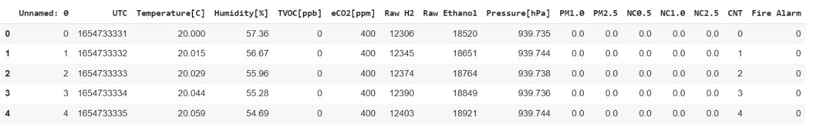
Kita dapat menghapus feature 'Unnamed: 0' Kemudian melihat dimensi dari dataset ini:
```
df = df.drop(columns='Unnamed: 0')
print("Row: {}, Columns: {}".format(df.shape[0], df.shape[1]))
```
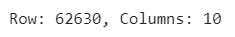


Dataset ini terdiri dari 62630 data dan 10 columns. seluruh data dari dataset bertipe numeric.

### Exploratory Data Analysis - Deskripsi Variabel:
Exploratory data analysis atau sering disingkat EDA merupakan proses investigasi awal pada data untuk menganalisis karakteristik, menemukan pola, anomali, dan memeriksa asumsi pada data. Teknik ini biasanya menggunakan bantuan statistik dan representasi grafis atau visualisasi.

Cakupan proses EDA sangat luas. Namun, secara umum, Anda dapat melakukan proses EDA untuk menjawab beberapa pertanyaan berikut:

1. Apa saja jenis variabel pada dataset?
2. Bagaimana distribusi variabel dalam dataset?
3. Apakah ada missing value?
4. Apakah ada fitur yang tidak berguna (redundant)?
5. Bagaimana korelasi antara fitur dan target?


Melakukan pengecekkan informasi pada tiap variabel pada dataset kita: 
```
df.info()
```
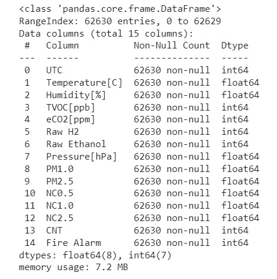
> Seluruh feature pada dataset kita bertipe numeric.

Melakukan pengecekkan deskripsi statistik pada dataset kita untuk mengetahui apakah terdapat anomalies:
```
df.describe()
```
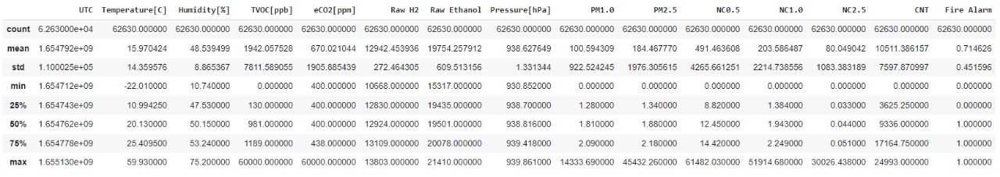
> Tidak ada keanehan dari basic stats diatas.

Fungsi describe() memberikan informasi statistik pada masing-masing kolom, antara lain:

1. Count  adalah jumlah sampel pada data.
2. Mean adalah nilai rata-rata.
3. Std adalah standar deviasi.
4. Min yaitu nilai minimum setiap kolom. 
5. 25% adalah kuartil pertama. Kuartil adalah nilai yang menandai batas interval dalam empat bagian sebaran yang sama. 
6. 50% adalah kuartil kedua, atau biasa juga disebut median (nilai tengah).
7. 75% adalah kuartil ketiga.
8. Max adalah nilai maksimum.

### Exploratory Exploratory Data Analysis - Menangani Missing Value dan Outliers:
Untuk Melihat missing value pada dataset kita:
```
Total = df.isnull().sum().sort_values(ascending=False)          

Percent = (df.isnull().sum()*100/df.isnull().count()).sort_values(ascending=False)   

missing_data = pd.concat([Total, Percent], axis = 1, keys = ['Total', 'Percentage of Missing Values'])    
missing_data
```
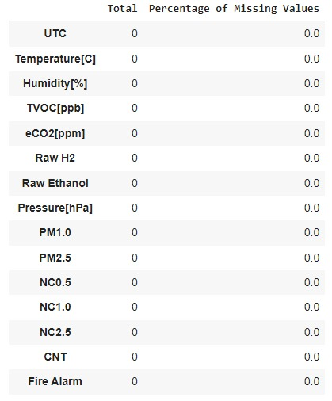
> Tidak terdapat missing value pada dataset kita.

Untuk melihat outliers pada dataset kita: 
```
cols = df.columns
for i, col in enumerate(cols):
  print("Column:",col)
  plt.figure()
  sns.boxplot(x=df[col])
  plt.show()
```
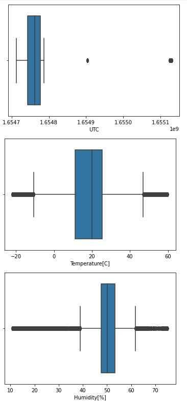
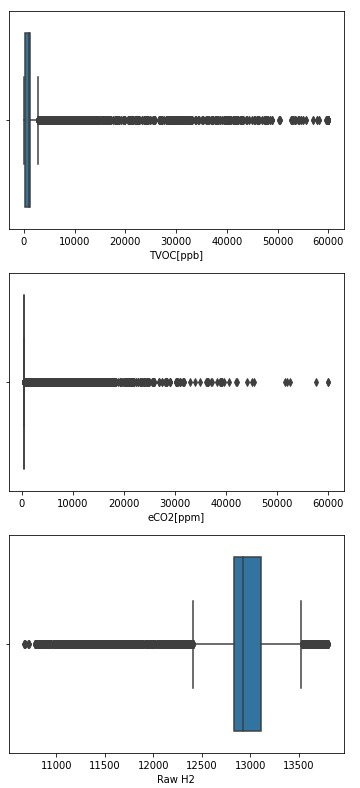
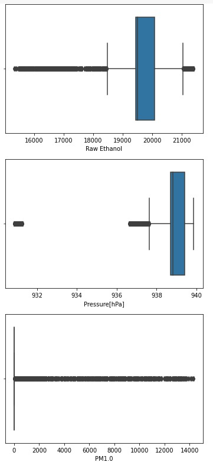
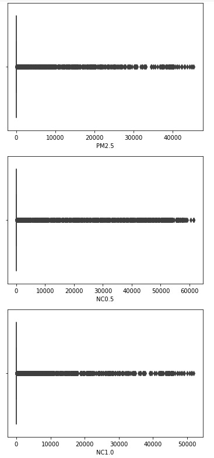
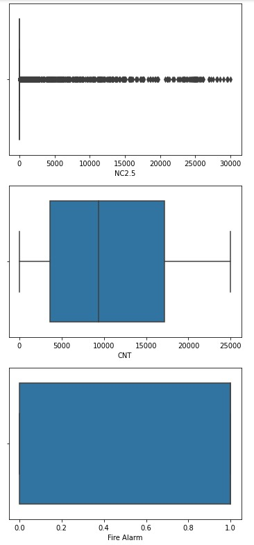
> Dengan melihat konsistensi nilai-nilai outlier dapat diartikan bahwa hal tersebut bukan karena kesalahan manusia saat menghitung.

### Exploratory Data Analysis - Univariate Analysis:
Untuk melihat proporsi dari nilai variabel target yang kita punya:
```
trace = go.Pie(labels = ['Yes_Fire', 'No_Fire'], values = df['Fire Alarm'].value_counts(), 
               textfont=dict(size=15), opacity = 0.8,
               marker=dict(colors=['ldarkblue','orange'], 
                           line=dict(color='#000000', width=1.5)))

layout = dict(title =  'Distribution of Fire Alarm variable')
           
fig = dict(data = [trace], layout=layout)
py.iplot(fig)
```
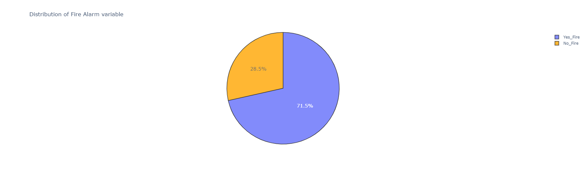
Terjadi data imbalance pada variabel target. kita dapat melakukan pendekatan undersampling dan uppersampling pada variabel target atau dengan cara lain yaitu memilih metric yang tepat seperti recall, precision dan F1 Score. kita tidak dapat menggunakan metric akurasi karena dapat menyebabkan bias pada saat scoring model.

### Exploratory Data Analysis - Multivariate Analysis:
Untuk melihat KDE plot dari tiap variable:
```
plt.figure(figsize=(15,5))
sns.kdeplot( data=df, x='Humidity[%]', hue='Fire Alarm', fill = True)
plt.legend(loc='upper left', labels=['no fire', 'yes fire'])
plt.title('Humidity vs Fire density')
plt.show()
```
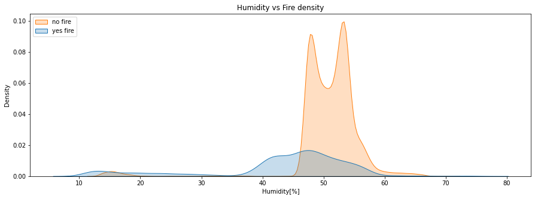
   > Selama experiment kemungkinan fire alarm ditempat yang memiliki kelembapan cukup tinggi. karena puncak density pada visualisasi diatas mencakup kelembapan > 40%
```
plt.figure(figsize=(15,5))
sns.kdeplot( data=df, x='Temperature[C]', hue='Fire Alarm', fill = True)
plt.legend(loc='upper left', labels=['no fire', 'yes fire'])
plt.title('Temperature vs Fire density')
plt.show()
```
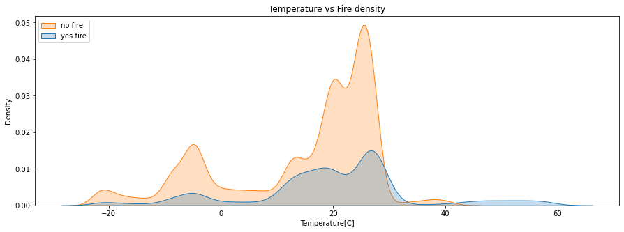
   > Selama experiment kemungkinan fire alarm ditempat yang memiliki temperature sekitar 20 celcius
```
plt.figure(figsize=(15,5))
sns.kdeplot( data=df, x='Pressure[hPa]', hue='Fire Alarm', fill = True)
plt.legend(loc='upper left', labels=['no fire', 'yes fire'])
plt.title('Pressure vs Fire density')
plt.show()
```
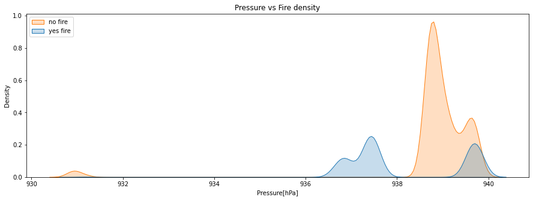
   > Berdasarkan puncak density dari visualisasi diatas dapat kita lihat bahwa semakin tinggi Pressure maka kemungkinan untuk fire alarm berbunyi semakin besar juga
```
plt.figure(figsize=(15,5))
sns.kdeplot( data=df, x='Raw H2', hue='Fire Alarm', fill = True)
plt.legend(loc='upper left', labels=['no fire', 'yes fire'])
plt.title('Raw H2 vs Fire density')
plt.show()
```
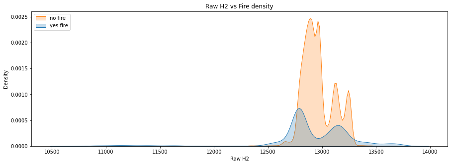
   > Berdasarkan puncak density dari visualisasi diatas dapat kita lihat bahwa yes fire dan no fire memiliki rentang yang serupa yaitu 12500 - 1340
```
plt.figure(figsize=(15,5))
sns.kdeplot( data=df, x='Raw Ethanol', hue='Fire Alarm', fill = True)
plt.legend(loc='upper left', labels=['no fire', 'yes fire'])
plt.title('Raw Ethanol vs Fire density')
plt.show()
```
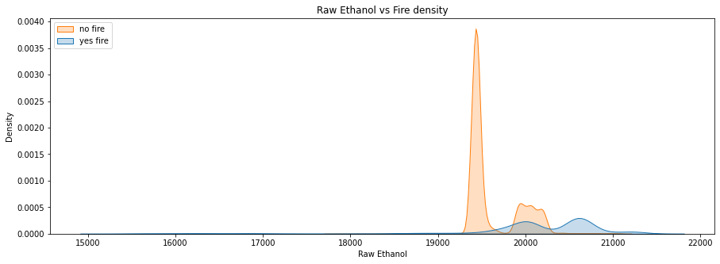
   > Berdasarkan puncak density dari visualisasi diatas dapat kita lihat bahwa yes fire memiliki kecenderungan berada di jumlah Raw Ethanol sekitar 19500 - 20500 dan no fire memiliki kecenderungan berada di jumlah Raw Ethanol sekitar 20000 - 21000

Untuk melihat korelasi antara tiap feature:
 ```
plt.figure(figsize = (12,12))
sns.heatmap(df.corr(),annot = True,cmap = 'GnBu')
plt.show()
```
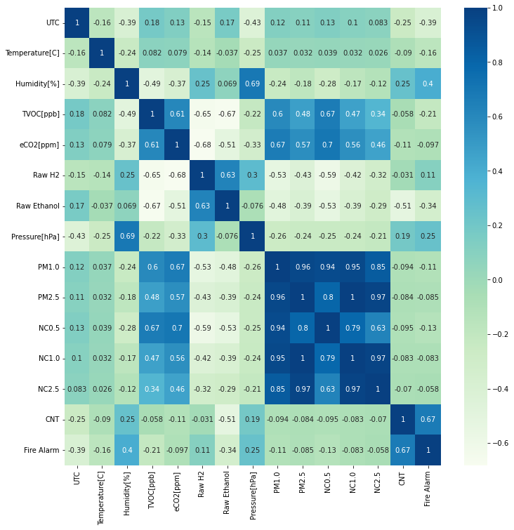
- Semua column 'PM's dan 'NC's memiliki korelasi yang tinggi dengan sesama kolom tersebut
- Tidak ada feature yang berkorelasi tinggi dengan feature target. Humidity, Pressure dan Raw H2 adalah feature yang memiliki korelasi positif namun tidak tinggi dan sisanya adalah feature yang berkorelasi rendah dengan feature targetnya.

## Data Preparation
Pada bagian ini Anda menerapkan dan menyebutkan teknik data preparation yang dilakukan. Teknik yang digunakan pada notebook dan laporan harus berurutan.

Pada bagian ini kita akan melakukan empat tahap persiapan data, yaitu:

- Feature Selection.
- Reduksi dimensi dengan Principal Component Analysis (PCA).
- Pembagian dataset dengan fungsi train_test_split dari library sklearn.
- Standarisasi.

### Feature Selection
Feature selection adalah proses mengurangi jumlah fitur atau variabel input dengan memilih fitur-fitur yang dianggap paling relevan terhadap model.

- Fitur yang sangat didominasi oleh satu nilai saja akan dibuang pada tahap ini. karena feature yang didominasi satu nilai saja tidak berarti untuk machine learning.
```
for col in df.columns.tolist():
    print(df[col].value_counts(normalize=True)*100)
    print('\n')
```
> Tidak ada feature dengan satu nilai saja maka tidak ada feature yang harus dibuang. 

- menghapus kolom UTC karena tidak berpengaruh pada model machine learning sehingga hal ini dapat memudahkan machine learning dalam pencari pola dari dataset kita.
```
df = df.drop(columns='UTC')
```

### Principal Component Analysis (PCA)
PCA bekerja menggunakan metode aljabar linier. Ia mengasumsikan bahwa sekumpulan data pada arah dengan varians terbesar merupakan yang paling penting (utama). PCA umumnya digunakan ketika variabel dalam data memiliki korelasi yang tinggi. Korelasi tinggi ini menunjukkan data yang berulang atau redundant.

Berdasarkan visualisasi korelasi diatas kita akan melakukan PCA pada feature PM1.0, PM2.5, NC0.5, NC1.0 dan NC2.5.

```
pca = PCA(n_components=5, random_state=42)
pca.fit(df[['PM1.0', 'PM2.5', 'NC0.5', 'NC1.0','NC2.5']])
princ_comp = pca.transform(df[['PM1.0', 'PM2.5', 'NC0.5', 'NC1.0','NC2.5']])
```
- parameter n_components adalah jumlah komponen atau dimensi seperti dikasus ini 5 yaitu 'PM1.0', 'PM2.5', 'NC0.5', 'NC1.0' dan 'NC2.5'
- parameter random_state berfungsi untuk mengontrol random number generator yang digunakan. Parameter ini berupa bilangan integer dan nilainya bebas. Pada kasus ini, kita menerapkan random_state = 42. Berapa pun nilai integer yang kita tentukan. selama itu bilangan integer, ia akan memberikan hasil yang sama setiap kali dilakukan pemanggilan fungsi (dalam kasus kita, class PCA).

```
pca.explained_variance_ratio_.round(3)
```
> Arti dari output di atas adalah, 0.9% informasi pada kelima fitur 'PM1.0', 'PM2.5', 'NC0.5', 'NC1.0' dan 'NC2.5' terdapat pada PC pertama. Sedangkan sisanya, sebesar 0.1%, 0.0%, 0.0% dan 0.0% terdapat pada PC kedua, ketiga, keempat dan kelima.

Dari hasil diatas kita dapat mempertahankan PC pertama saja untuk menggantikan kelima feature yang telah direduksi sebelumnya lalu kita beri nama feature ini dengan 'dimension'

```
pca = PCA(n_components=1, random_state=42)
pca.fit(df[['PM1.0', 'PM2.5', 'NC0.5', 'NC1.0','NC2.5']])
df['dimension'] = pca.transform(df.loc[:, ('PM1.0', 'PM2.5', 'NC0.5', 'NC1.0','NC2.5')]).flatten()
df.drop(['PM1.0', 'PM2.5', 'NC0.5', 'NC1.0','NC2.5'], axis=1, inplace=True)
```

### Pembagian dataset

Setelah kita melakukan dimensional reduction, kita dapat melakukan split data ke dalam beberapa bagian yaitu data train dan data test. kita melakukan beberapa transformasi pada data train sedangkan data test kita gunakan sebagai data uji yang diasumsikan adalah data baru sama halnya nanti di production. karna data test adalah data baru sehingga kita tidak diperkenankan untuk melakukan transformasi apapun, jika kita melakukan transformasi pada data test itu akan menimbulkan masalah baru yaitu data leakage dan dapat menyebabkan model machine learning kita bias.

proporsi pembagian data latih dan uji biasanya adalah 80:20. Ingatlah bahwa proporsi ini hanya kebiasaan umum saja. Tujuan dari data uji adalah untuk untuk mengukur kinerja model pada data baru. Jadi, jika dataset yang kita miliki berukuran sangat kecil, misalnya kurang dari 1.000 sampel, maka pembagian 80:20 ini cukup ideal. Namun, jika memiliki dataset berukuran besar, kita perlu memikirkan strategi pembagian dataset lain agar proporsi data uji tidak terlalu banyak.

Sebagai contoh, Anda memiliki dataset berjumlah 5 juta sampel. Dengan proporsi pembagian 80:20, maka data uji akan berjumlah 1 juta sampel. Tentu ini merupakan jumlah yang terlalu banyak karena kita tidak membutuhkan 1 juta sampel hanya untuk proses pengujian. Dalam kasus proses pengujian ini sebenarnya kita cukup menggunakan 1-2% data atau sebanyak 100.000 hingga 200.000 sampel saja.

<b>Bisa disimpulkan pembagian proporsi untuk data train dan data test sangat relative tergantung ketersedian dataset yang kita punya.</b>

Berikut adalah code untuk melakukan pembagian proporsi data train dan data test:
```
X = df.drop(["Fire Alarm"],axis =1)
y = df["Fire Alarm"]
X_train, X_test, y_train, y_test = train_test_split(X, y, test_size = 0.1, random_state = 42)
```
Penjelasan:
- X adalah sebagai variabel independen
- y adalah sebagai variabel dependen
- test_size adalah proporsi untuk data testnya
- random_state berfungsi untuk mengontrol random number generator yang digunakan.

Melihat dimensi hasil pembagian pada data train dan data test:
```
print(f'Total # of sample in whole dataset: {len(X)}')
print(f'Total # of sample in train dataset: {len(X_train)}')
print(f'Total # of sample in test dataset: {len(X_test)}')
```

### Standarisasi
Setelah melakukan split data ke dalam data train dan data test, Selanjutnya adalah melakukan data scaling, Karena value pada tiap feature memiliki angka yang signifikan dan hal itu dapat mengakibatkan model dari machine learning kita kesulitan dalam mencari polanya sehingga kita dapat menyeragamkan value tersebut kedalam rentang -1 to 1 menggunakan StandardScaler pada library sklearn.

code untuk standarisasi:
```
scaling = StandardScaler()
X_train = scaling.fit_transform(X_train)
```

## Modeling

Kita akan lakukan training pada data train dan melakukan predict pada data test yang telah kita split sebelumnya. Algoritma yang akan kita gunakan adalah Logistic Regression.

Logistic Regression hampir mirip dengan Linear Regression, memiliki kemiripan yaitu sama-sama memiliki garis regresi. Salah satu yang membedakan adalah Logistic Regression digunakan untuk menentukan prediksi yang kita buat benar atau salah sedangkan Linear Regression digunakan untuk memprediksi nilai yang kontinu.

Kenapa saya menggunakan Logistic Regression? ini dikarenakan alogritma model ini sangat baik bahkan memang keahliannya dalam menangani kasus binary classification.

Kelebihan Logistic Regression:
- Ketika terjadi overfitting pada algoritma Logistic Regression kita dapat menggunakan parameter regularisasi (L1 dan L2) untuk menghindari overfitting.
- Tidak memerlukan spek device yang tinggi untuk melakukan training pada algoritma logistic regression.
- bagus Ketika digunakan pada masalah binary classification.
illustration images

Kekurangan Logistic Regression: 
- Pada data dengan high dimensional akan memiliki kecenderungan overfitting, salah satu cara untuk menghindari hal tersebut adalah dengan melakukan regularization akan tetapi hal tersebut dapat menambah kompleksitas dari model yang akan dihasilkan
- Permasalahan non-linear sulit untuk diselesaikan menggunakan logistic regression dikarenakan memiliki linear decision surface.

Selanutnya kita Mendefine sebuah object dari LogisticRegression dan beberapa parameter yang akan kita lakukan hyperparameter tuning untuk mendapatkan parameter terbaik pada case kita. 

```
model = LogisticRegression()
solvers = ['newton-cg', 'lbfgs', 'liblinear']
penalty = ['l2']
c_values = [100, 10, 1.0, 0.1, 0.01]
```
penjelasan dari setiap parameter:

- solvers adalah optimizer dari algoritma yang akan kita gunakan sebagai method untuk mencari loss terkecil dari gradient descent
- C_values adalah nilai dari regularization yang kita gunakan, semakin kecil semakin memanandakan regularization yang kita lakukan semakin kuat. gunanya adalah untuk menghindari overfitting.
- penalty adalah bentuk regularization dari nilai yang telah kita specify sebelumnya pada c_values. terdapat beberapa jenis penalty yang dapat kita kombinasikan sehingga mendapat hasil yang maksimal:
images jenis regularization

Selanjutnya adalah melakukan hyperparameter tuning menggunakan GridSearchCV. GridSearchCV adalah metode pemilihan kombinasi model dan hyperparameter dengan cara menguji coba satu persatu kombinasi dan melakukan validasi untuk setiap kombinasi. Tujuannya adalah menentukan kombinasi yang menghasilkan performa model terbaik yang dapat dipilih untuk dijadikan model untuk prediksi.

```
grid = dict(solver=solvers,penalty=penalty,C=c_values)
grid_search = GridSearchCV(estimator=model, param_grid=grid, n_jobs=-1, cv=3, scoring='recall')
grid_result = grid_search.fit(X, y)
```
penjelasan dari parameter yang kita gunakan:

- estimator adalah object dari algoritma yang telah kita define sebelumnya.
- param_grid adalah parameter dari logistic regression yang akan kita lakukan hyperparameter tuning untuk mencari kombinasi parameter yang terbaik
- n_jobs adalah jumlah dari processor yang akan kita gunakan untuk nge running jobs tersebut secara parallel. value -1 berarti kita nge running jobs tersebut menggunakan seluruh dari processor yang kita punya.
- cv adalah cross-validation generator yang dimana kita menentukan ingin melakukan berapa kali percobaan secara acak pada dataset kita. illustrasi:

## Evaluation
Menampilkan hasil dari prediksi berupa score dari setiap kombinasi parameter yang kita lakukan tuning sebelumnya.

Untuk melihat hasil recall score dan parameter yang kita gunakan setelah melewati tahap hyperparameter tuning:

```
# summarize results
print("Best: %f using %s" % (grid_result.best_score_, grid_result.best_params_))
means = grid_result.cv_results_['mean_test_score']
stds = grid_result.cv_results_['std_test_score']
params = grid_result.cv_results_['params']
for mean, stdev, param in zip(means, stds, params):
    print("%f (%f) with: %r" % (mean, stdev, param))
```

Alhamdulillah, kita mendapat score dari metric recall yang sangat baik yaitu 96% namun score ini masih dapat kita improve menggunakan beberapa cara yaitu feature importance, melakukan feature engineering dan menggunakan parameter lebih banyak lagi untuk di hyperparameter tuning.

metric yang kita gunakan pada kasus ini adalah: Recall, karena kita menginginkan hasil dari False Negative(FN) sekecil mungkin sehingga kita akan menggunakan recall sebagai metric patokan pada kasus ini. konsep dari recall ini sebagai berikut:
images formula recall

Penjelasan dari formula diatas:
- True Positve berarti model machine learning kita berhasil memprediksi bahwa ditempat tersebut terdapat asap dan memang terdapat asap di tempat tersebut.
- False Negative berarti model machine learning kita memprediksi bahwa ditempat tersebut tidak ada asap padahal ditempat tersebut terdapat asap. model machine learning kita disini gagal mendeteksi adanya asap. 

Recall adalah salah satu metric dari kasus classification yang lebih fokus untuk memprediksi asap dalam ruangan tersebut padahal tidak ada asap. dibandingkan model kita memprediksi tidak ada asap dalam ruangan tersebut padahal terdapat asap. tentu akan sangat fatal jika kita memilih model kita fokus memprediksi tidak ada asap dalam ruangan tersebut padahal terdapat asap, karena jika asap yang keluar adalah potensi dari kebakaran maka hal tersebut dapat berbahaya bagi orang yang ada didalam ruangan tersebut.

**---END---**

